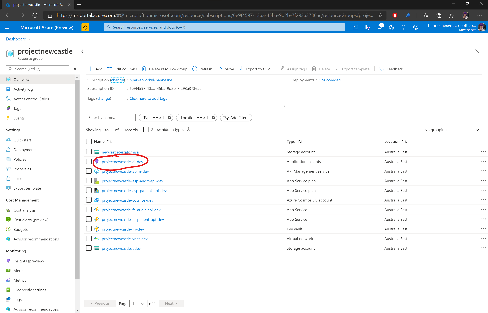
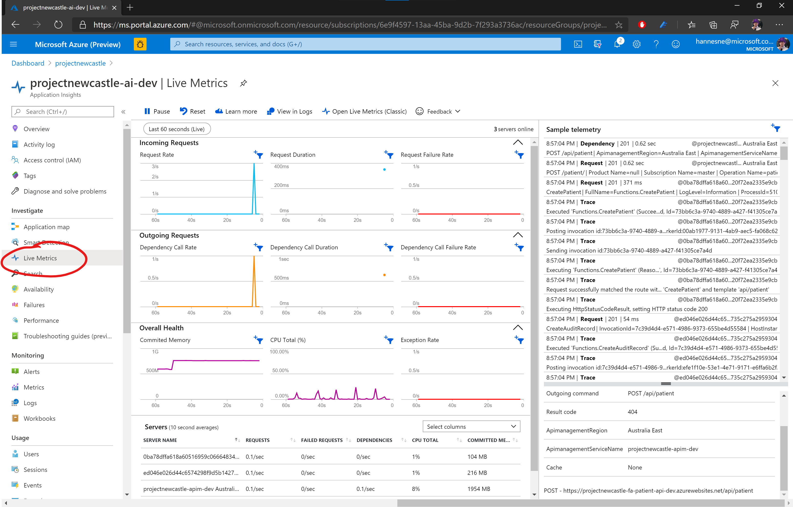
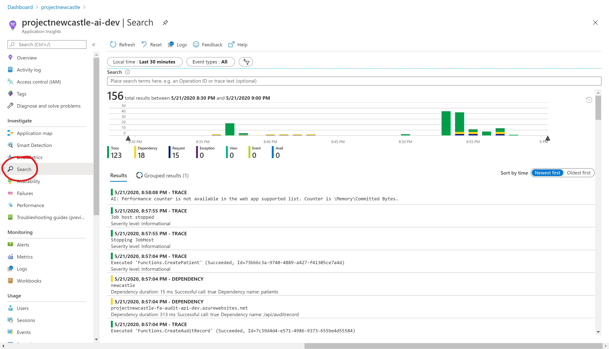
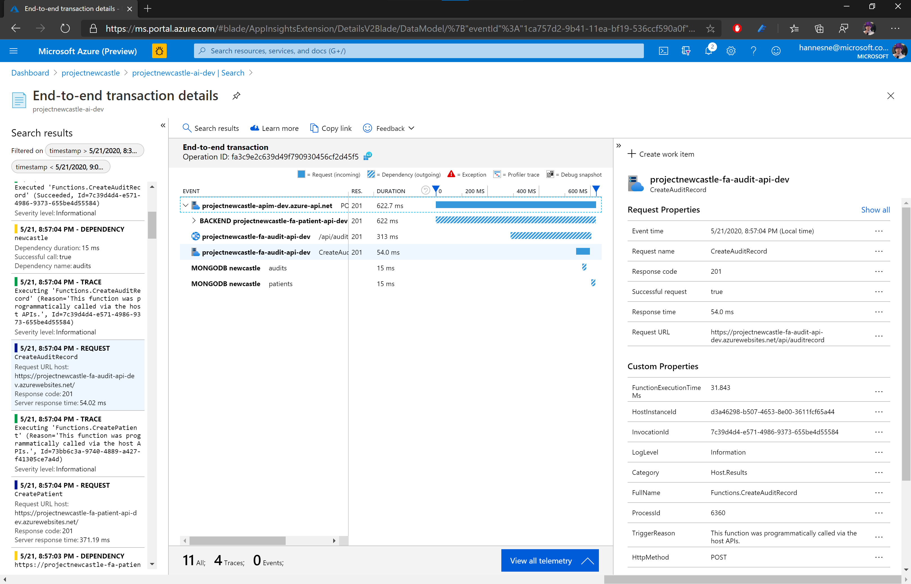
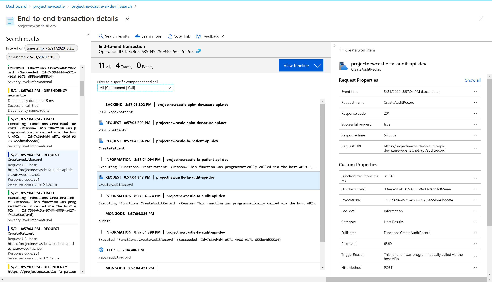
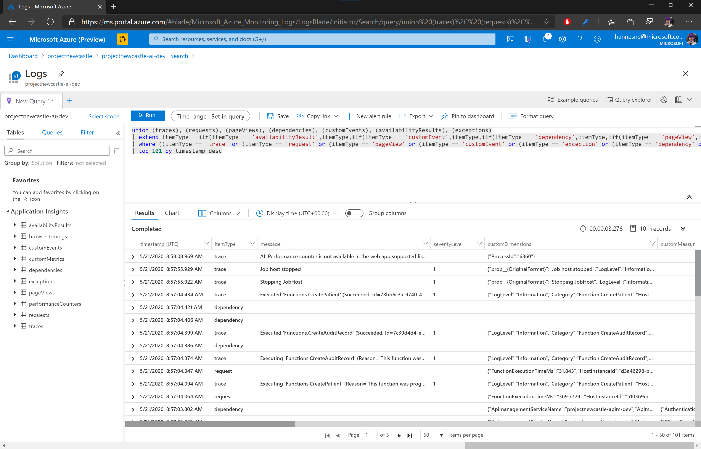

# Distributed Telemetry

## Overview

Project Newcastle is an example of a microservices based architecture. A common issue with these architectures, is that failures can be caused by a set of circumstances distributed over a variety of components. This can make it hard to diagnose issues, when looking at components in isolation. The ability to correlate the telemetry for an operation across components becomes vital to diagnose certain issues.
An example might be that Service A have a dependency on Service B. Service A starts experiencing intermittent timeouts on requests to Service B, resulting in an internal server error. Service B does not experience any errors that are being logged, it is just taking too long to serve these requests because of a particular data access pattern associated with the request. By being able to correlate the request across service A and service B, and seeing the surrounding requests in Service B, we can determine which data queries in service B is associated with the timeouts experienced in service A, and take appropriate remedial action.

## Solution

Project Newcastle makes use of Application Insights to centralize logging across components. Components contributing to the telemetry includes API Management and the PatientTests and Audit API’s running on Azure Functions.
API Management and the Azure Functions runtime has built-in support for Application Insights to generate and correlate a wide variety of telemetry, including standard application output. The Application Insights Nodejs SDK is used in the Function apps to manually track dependencies and other custom telemetry.
The telemetry sent to Application Insights can feed into a wider Azure Monitor workspace. Components such as Cosmos Db can send telemetry to Azure Monitor, where it can be correlated with telemetry from Application Insights. This is beyond the scope of Project Newcastle.

## Configuration

You can use the Terraform templates in the [`/env`](../env) folder to deploy and configure Project Newcastle in your own subscription. This will include deploying Application Management and the Function apps and configuring them to use the deployed Application Insights instance. It automates the following process:

1. Deploy Application Insights
2. Get the Application Insights instrumentation key
3. Deploy Azure Functions apps
4. Set APPINSIGHTS_INSTRUMENTATIONKEY app setting on Azure Function Apps
5. Deploy API Management
6. Add a logger to API Management for the deployed Application Insights instance
7. Add the configured logger to diagnostics for APIs

Exact instructions for running the terraform deployment is available in the [`/env` readme](../env/readme.md)

## Viewing telemetry

1. To see the telemetry that has been gathered, open the App Insights instance that you created in the Azure Portal:


2. You can view live telemetry by clicking on the Live Metrics button in the left menu list. This will show most of the telemetry as it comes in, along with metrics from the server. Post a new patient to the API Management instance to see the telemetry stream. A sample payload is available in the [PatientTests API readme](../src/PatientTestsApi/readme.md):


3. To see the full transaction detail, open the search blade from the left sidebar menu. Telemetry may take a few minutes to show up in this view:


4. Clicking on a telemetry item, such as a request, will open the end-to-end transaction blade, on the timeline view:


5. This does not show the trace telemetry associated with the request. Click on *View all telemetry* to show the full list of correlated telemetry.


6. For more powerful and flexible querying, you can view the telemetry in Log Analytics. Scroll back to the search blade and click the *Logs* button. This will open a Log Analytics blade, with a prepopulated query showing the telemetry visible in the search blade.


## Operation

### Automatic telemetry gathering

Once this environment is correctly configured, API Management will start adding a `request-id` header to the backend requests.
The Azure Functions runtime will read this header and use it to create a `TraceContext` for the request.  Any telemetry that the runtime logs associated with this request, will have the `operationId` and `parentId` set according to the incoming `request-id` header. This allows App Insights to correlate the Trace, Exception, and Request telemetry from the Azure Functions runtime with the Request telemetry from Azure API Management.
The NodeJS SDK for Application Insights can also apply automatic dependency gathering to certain libraries such as the mongo driver. We evaluated this in Project Newcastle but found that dependencies were logged inconsistently for the mongo API.
The SDK can also be configured to add required correlation headers to outgoing http requests. This also didn’t work as expected in an Azure Function app, because the request state was not being set correctly per request. It also required us to create a new TelemetryClient for each request, which may lead to performance issues.

### Manual Telemetry logging

To fix these two issues, you need to

1. manually track the dependency telemetry
2. add required context headers to outgoing http requests.

To enable this, Azure Functions exposes a `traceContext` object on the context parameter passed to the Azure Functions execution.
We extracted some code from the NodeJs SDK for Application Insights, and modified it to use this `traceContext` object to populate the neccesary variables and headers when logging a dependency telemetry or an outgoing request. The `traceContext` is passed to the `controllerFactory` when a new controller is requested. You can see this in [`src/PatientTestsApi/CreatePatient/index.ts`](../src/PatientTestsApi/CreatePatient/index.ts):

```typescript
const httpTrigger: AzureFunction = async function (context: Context, req: HttpRequest): Promise<void> {
    const controller = await controllerFactory.createPatientController(context.traceContext, req);
  context.res = await controller.createPatient(req);
};
```

The controller factory injects this into new instances of the `AppInsightsService`, which is used to initialize a `CorrelationContext`. This context is associated with the request. The `AppInsightsService` uses a singleton instance of `TelemetryClient` to prevent http port exhaustion.

#### Tracking dependency telemetry

The `AppInsightsService` is passed along to data services that uses it to log dependencies. An example of this may be found in [`LoggingCollection`](../src/PatientTestsApi/Services/LoggingCollection.ts) This collection wraps calls to other collections (which may be a `Collection` from the mongo driver). It will log information about the call to the underlying collection using the `AppInsightsService.trackDependency` function:

```typescript
private async trackDependency<T>(fn: () => Promise<T>, query: string): Promise<T> {
    const timer = new Timer();

    try {
      const result = await fn();
      timer.stop();
      const dependency = this.createDependency(query, timer, 0, true);
      this.appInsights.trackDependency(dependency);
      return result;

    } catch (e) {
      timer.stop();
      const dependency = this.createDependency(query, timer, JSON.stringify(e, Object.getOwnPropertyNames(e)), false);
      this.appInsights.trackDependency(dependency);
      throw e;
    }
  }
```

Both successful and unsuccessful calls are logged with different parameters. The detail of this implementation is neatly abstracted from the consumers of the `LoggingCollection`. The [`AppInsightsService`](../src/AuditApi/Services/app-insights/app-insights-service.ts) in turn will add any required context to the telemetry, abstracting information about the request from its consumers:

```typescript
public trackDependency({ data, dependencyTypeName, duration, time, resultCode, success, name, target }: IDependencyTelemetry): void {

    if (!this.client) { return; }

    // https://github.com/MicrosoftDocs/azure-docs/pull/52838/files
    // Use this with 'tagOverrides' to correlate custom telemetry to the parent function invocation.
    const tagOverrides: {[key: string]: string} = {};
    if (this.correlationContext) {
      tagOverrides['ai.operation.id'] = this.correlationContext.operation.id;
      tagOverrides['ai.operation.name'] = this.correlationContext.operation.name;
      tagOverrides['ai.operation.parentid'] = this.correlationContext.operation.parentId;
    }

    const dependency: DependencyTelemetry = {
      data,
      dependencyTypeName,
      duration,
      resultCode,
      success,
      contextObjects: this.correlationContext ?? undefined,
      tagOverrides,
      name,
      target,
      time
    };
    this.client.trackDependency(dependency);
  }
```

The key here is setting `tagOverrides` using the fields exposed on the `CorrelationContext`. This is what allows App Insights to correlate this dependency with the other telemetry.

#### Add tracking headers to outgoing requests

The request context needs to be passed to downstream services to enable them to tag telemetry with the appropriate operation and parent id's. In Project Newcastle we abstracted http communication in an [`HttpDataService`](../src/PatientTestsApi/Services/HttpDataService.ts). This data service is instantiated in the [`ControllerFactory`](../src/PatientTestsApi/Controllers/ControllerFactory.ts) with an instance of `AppInsightsService`, and passed to the `AuditService`. The `AuditService` uses it to make any outgoing http requests:

```typescript
public async LogAuditRecord(expectedResource: IAuditResource): Promise<void> {
    if (this.settings.auditAPIUrl){
      const auditRecord: IAuditRecord = {
        sourceSystemName: "PatientTestApi",
        resource: expectedResource
      };
      await this.dataService.makeHttpPostCall(this.settings.auditAPIUrl, {"x-functions-key": this.settings.auditAuthKey!}, auditRecord);
    }
  }
```

The `HttpDataService` obtains the relevant request headers for telemetry correlation from the `AppInsightsService`, and adds them to provided headers:

```typescript
const appInsightsHeaders = this.appInsightsService.getHeadersForRequest();

    const headersWithCorrelationContext = { ...headers, ...appInsightsHeaders };

    const requestConfig: AxiosRequestConfig = {
      headers: headersWithCorrelationContext,
      params: queryParams
    };
```

The `AppInsightsService` generates these headers from the `TraceContext` injected in its contructor.
Like the `LoggingCollection`, the `HttpDataService` will also log dependency telemetry for the outgoing request.

## Testing

Project Newcastle has a full suite of unit tests. By abstracting the calls to Application Insights within the `AppInsightsService`, it is possible to verify that the data services will log any requests and failures correctly.
An example of logging dependency tracking for Mongo DB can be found in [`LoggingCollection.spec.ts`](../src/PatientTestsApi/Test/Services/LoggingCollection.spec.ts):

```typescript
it("Tracks dependencies for succesful database calls", async function(): Promise<void> {
    const mockCollection = mock<ICollection>();
    const expectedResult = createOneInsertResult();
    const expectedDoc = {key:"value"};
    when(mockCollection.insertOne(expectedDoc, anything())).thenResolve(expectedResult);
    const mockAppInsightsService = mock<IAppInsightsService>();
    const expectedCollectionName = "collectionName";
    const expectedDbName = "dbName";
    const appInsightsService = instance(mockAppInsightsService);
    const collection = new LoggingCollection(instance(mockCollection), appInsightsService, expectedCollectionName, expectedDbName);

    const result = await collection.insertOne(expectedDoc, {});

    expect(result).is.equal(expectedResult);

    const [actualTelemetry] = capture(mockAppInsightsService.trackDependency).first();
    expect(actualTelemetry.data).is.equal("{\"insertOne\":{\"options\":{}}}");
    expect(actualTelemetry.dependencyTypeName).is.equal("mongodb");
    expect(actualTelemetry.resultCode).is.equal(0);
    expect(actualTelemetry.success).is.equal(true);
    expect(actualTelemetry.name).is.equal(expectedCollectionName);
    expect(actualTelemetry.target).is.equal(expectedDbName);

  });
```

The tests create a mock implementation of the `AppInsightsService`, and injects it into the LoggingCollection. This allows it to verify that the `trackDependency` function is called with the expected parameters.
Similar tests exist for the `HttpDataService`.
