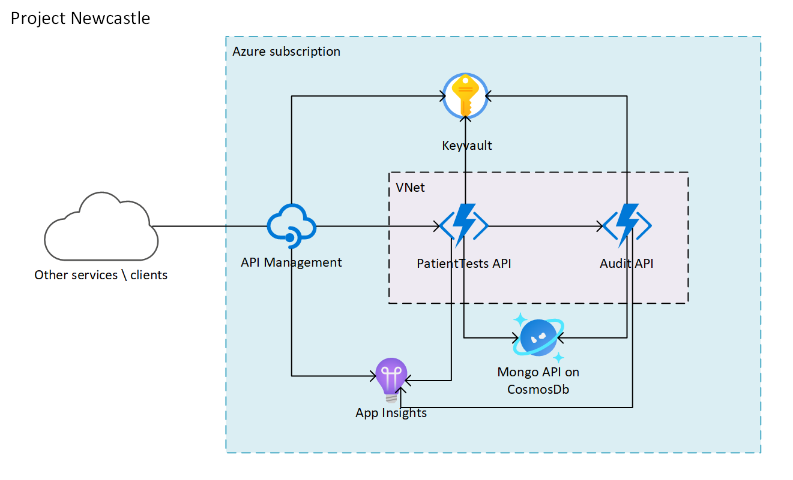

# Security Pattern for Communication among API Management, Function Apps and Comos DB
In our solution architecture below, there is one API Management instance, two Function Apps (plus associated Key Vault) and one Cosmos DB instance. Let's first take patient creation as example to describe the communication among those components and we will talk about Key Vault later.
1. Other services and clients first make a POST request with a data body including patient information to Patient API in API Management.
2. Since Patient API uses PatientTests API function app as its backend, it will call `CreatePatient` function in PatientTests API function app with the given patient information.
3. For auditing purposes, all operations related with sensitive information need to be recorded. So `CreatePatient` function in PatientTests API will call `CreateAuditRecord` function in Audit API function app to create an audit record.
4. `CreateAuditRecord` function will create an audit record in Cosmos DB and return success response to `CreatePatient` function.
5. `CreatePatient` function will create a patient document in Cosmos DB and return success response to API Management.
6. Other services and clients receive success response from API Management.



As it can be seen, the communication among those components is not complex, but there are still some security considerations we need to pay attention to. We implemented a security pattern with [Terraform](https://www.terraform.io/) behind the scenes. In this document, we will describe the security pattern for communication between API Management, Function Apps, and Cosmos DB in the above solution architecture. Two aspects will be discussed in the security pattern.
- Networking lockdown: controls the network access to APIs or functions
- Access keys: requires callers to send a key when calling APIs or functions and leverages Key Vault to store keys

## Networking Lockdown
When creating APIs or functions, we may not want to expose them publicly, so we will want to deploy them in a virtual network. In addition to using a vNet, we may also want to control the network access to our APIs and functions, e.g., only allowing a specific IP address. Both API Management and Function App support access restriction and deployment in virtual network. Please refer to "Further Readings" for more details.

In our scenario, we only enabled access restriction and virtual network deployment for two function apps, but not for API Management, because we want to expose API Management publicly and allow clients to test it from anywhere. The details for access restriction and virtual network deployment, for the two function apps, are discussed below.
- Access restriction: When we restrict access for function apps, we can restrict IPv4, IPv6 and a virtual network subnet.
    - PatientTests API function app only allows API Management to call it and API Management is the only entry point for the whole system. Since each API Management has a list of fixed public IP addresses, we just need to add those IP addresses in the access restriction allow list of PatientTests API function app. We only deployed API Management to a single region, so there is only one public IP address of API Management and we just need to add that IP address. By default, a function app allows all IP addresses, but once you add one IP address, all the others will be denied.
    - We deployed PatientTests API function app in a virtual network subnet and we also restricted access for Audit API, configuring Audit API function app to only allow in the virtual network subnet in which PatientTests API function app is deployed. To do so, we just need to add that virtual network subnet in the access restriction allow list of Audit API function app.
- Deployment to a virtual network: We used [regional virtual network integration](https://docs.microsoft.com/en-us/azure/azure-functions/functions-networking-options#regional-virtual-network-integration) to deploy both function apps in the same virtual network in the same region. There are two key points when using regional virtual network integration.
    - Premium plan is needed if you want to have both regional virtual network integration and scalability.
    - Since the function app will be deployed in a subnet of the virtual network, we need to configure of the number of IP addresses in the subnet. One IP address is used for each service plan instance.

### Code Snippet in Terraform
We used Terraform to provision all resources and configurations including the networking lockdown. The complete code can be found in the `/env` folder. We just highlight some code snippets here.

- Access restriction: We can use `ip_restriction` block in `site_config` object to define the access restriction. Note that `ip_address` only accepts CIDR notation, e.g., 1.2.3.4/32 instead of 1.2.3.4. Refer [here](https://www.terraform.io/docs/providers/azurerm/r/function_app.html) for the syntax.
```
resource "azurerm_function_app" "fa" {
  ...
  site_config {
    ip_restriction {
      ip_address = var.ip_restriction_ip_address
      subnet_id  = var.ip_restriction_subnet_id
    }
  }
}
```

- Regional virtual network integration: We can use `azurerm_app_service_virtual_network_swift_connection` to implement the regional virtual network integration. Also pay attention to `delegation` block and `service_endpoints` of the subnet in which the function app is deployed. Refer to [here](https://www.terraform.io/docs/providers/azurerm/r/app_service_virtual_network_swift_connection.html) for the syntax. 
```
resource "azurerm_subnet" "snet" {
  ...
  delegation {
    name = "fadelegation"

    service_delegation {
      name    = "Microsoft.Web/serverFarms"
      actions = ["Microsoft.Network/virtualNetworks/subnets/action"]
    }
  }

  service_endpoints = ["Microsoft.Web"]
}

resource "azurerm_app_service_virtual_network_swift_connection" "vnet_int" {
  app_service_id = module.fa_patient_api.id
  subnet_id      = azurerm_subnet.snet.id
}
```

### Further Readings
- [API Management access restriction policies](https://docs.microsoft.com/en-us/azure/api-management/api-management-access-restriction-policies)
- [How to use Azure API Management with virtual networks
](https://docs.microsoft.com/en-us/azure/api-management/api-management-using-with-vnet)
- [IP addresses of Azure API Management
](https://docs.microsoft.com/en-us/azure/api-management/api-management-howto-ip-addresses)
- [Azure App Service access restrictions
](https://docs.microsoft.com/en-us/azure/app-service/app-service-ip-restrictions)
- [Azure Functions networking options
](https://docs.microsoft.com/en-us/azure/azure-functions/functions-networking-options)

## Access Keys
In the previous section, we discussed  network-level security, but this is only one aspect of the problem and may not be enough to protect your APIs and functions. Now we discuss access keys and how to securely store them using Key Vault.

First of all, let's have a look at the unsecured option, i.e., calling APIs or functions without keys. It is possible to do that in both API Management and the Function App.
- API Management: Uncheck the 'Require subscription' checkbox when creating a new product, so when you call an API in that product, you don't need to give the subscription key, e.g., `Ocp-Apim-Subscription-Key` in the HTTP header.
- Function App: You can set the HTTP access level on an HTTP triggered function to `anonymous` so that you don't need to include an API access key, e.g., `x-functions-key` in the HTTP header.

Disabling the access key is not a good practice, so we enable access keys in all components.
- API Management: A subscription key is required to call Patient API in API Management, so users need to include `Ocp-Apim-Subscription-Key` in the HTTP header.
- PatientTests API: An API access key is required to call all functions in PatientTests API function app. In our case, Patient API in API Management needs to include `x-functions-key` in the HTTP header when calling functions in PatientTests API function app.
- Audit API: An API access key is required to call `CreateAuditRecord` function in Audit API function app. In our case, all functions in PatientTests API function app need to include `x-functions-key` in the HTTP header when calling `CreateAuditRecord` function in Audit API function app.

In our scenario, we used host keys for both function apps. Where should we store those keys securely? In addition, both function apps use Cosmos DB as data store, so where shall we store the Cosmos DB connection string? There are many options. For example, PatientTests API function app can keep the host key of Audit API function app and the Cosmos DB connection string in the application settings. However, it's not a good practice, because the host key and connection string are exposed to all developers who can access the function app itself. The best practice is keeping sensitive information like the host keys and connection strings in Key Vault, especially for the production environment. This is the way we have implemented this scenario.
- All sensitive information is kept as secrets in Key Vault:
  - Host key of PatientTests API function app
  - Host key of Audit API function app
  - Cosmos DB connection string
- Managed Service Identity (MSI) was enabled for following components and granted GET secret permission to them:
  - API Management: needs to get the host key of PatientTests API function app
  - PatientTests API function app: needs to get the host key of Audit API function app and Cosmos DB connection string
  - Audit API function app: needs to get Cosmos DB connection string
- We implemented an advanced inbound policy for Patient API in API Management. Patient API will retrieve the host key of PatientTests API function app from Key Vault and cache it for better performance, so next time it will first look for the key in cache.
- We used Key Vault references for both function apps instead of keeping sensitive information in application settings directly.

### Code Snippet in Terraform
Same as networking lockdown, we used Terraform to implement the security pattern for access keys. The complete code can be found in the `/env` folder. We just highlight some code snippets here.

- Keep Cosmos DB connection string in Key Vault
```
resource "azurerm_cosmosdb_account" "cosmos" {
  ...
}

resource "azurerm_key_vault_secret" "cosmos_conn" {
  name         = "cosmos-conn"
  value        = azurerm_cosmosdb_account.cosmos.connection_strings[0]
  key_vault_id = azurerm_key_vault.kv.id
}
```

- Enable function app MSI and grant GET secret permissiion
```
resource "azurerm_function_app" "fa" {
  ...
  identity {
    type = "SystemAssigned"
  }
}

resource "azurerm_key_vault_access_policy" "fa" {
  key_vault_id = var.key_vault_id
  tenant_id    = azurerm_function_app.fa.identity[0].tenant_id
  object_id    = azurerm_function_app.fa.identity[0].principal_id

  secret_permissions = [
    "get"
  ]
}
```

### Further Readings
- [Subscriptions in Azure API Management](https://docs.microsoft.com/en-us/azure/api-management/api-management-subscriptions)
- [Function access keys](https://docs.microsoft.com/en-us/azure/azure-functions/functions-bindings-http-webhook-trigger?tabs=csharp#authorization-keys)
- [How to use managed identities for App Service and Azure Functions](https://docs.microsoft.com/en-us/azure/app-service/overview-managed-identity)
- [Use Key Vault references for App Service and Azure Functions](https://docs.microsoft.com/en-us/azure/app-service/app-service-key-vault-references)
