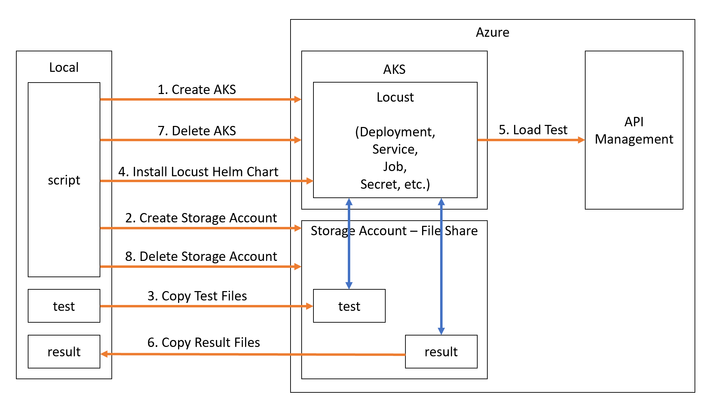

# Load Testing with Locust
Assume API performance is one of your concerns, you may want to use some tools to run load testing against your APIs. In our scenario, we use [Locust](https://locust.io/) to run load testing against API Management. [Locust](https://locust.io/) is an open source load testing tool and you write your load tests in Python. In the following sections, we will first introduce how to write Locust tests and then we will show you how to run Locust tests locally and remotely via AKS.

## Writing Locust tests
To write a Locust test, you need to define two classes:
- A subclass of TaskSet
- A subclass of Locust. In our case, we use `FastHttpLocust` for better performance.

Let's take a look at load test against Echo API as example. When you create API Management, Echo API is created by default as a simple API example.

```python
def Echo(self):
    return self.client.get(
        "echo/resource?param1=sample", 
        headers = {
            "Ocp-Apim-Subscription-Key": Variables.sub_key
        },
        catch_response = True
    )

class EchoTaskSet(TaskSet):
    @task
    def EchoTask(self):
        with Echo(self) as response:
            if response.status_code != 200:
                response.failure(f"Code: {response.status_code} | Content: {response.text} | Task: EchoTask")

class EchoLocust(FastHttpLocust):
    wait_time = Variables.wait_time
    task_set = EchoTaskSet
```

There are three parts in the above code snippet.
- `Echo` function calls the Echo API in API Management and returns the response.
- `EchoTaskSet` class defines the task set. It calls the `Echo` function and checks the response. It will record the error if the returned HTTP status code is not `200`.
- `EchoLocust` class defines what Locust will attack. In this case, all Locusts will do the `EchoTaskSet` and they will wait for `wait_time` seconds between two tasks. Usually the `wait_time` can be randomed in a range.

However, Echo API is not our target. In API Management, we implemented Patient API with several API operations e.g., patient creation, patient search, etc. and they are our load test target. So in our case we've written several Locust tests and some important files are listed below.
- [variables.py](./tests/locustscripts/variables.py) defines some variables like `wait_time`, `sub_key` (API Management subscription key) and so on.
- [locustfile.py](./tests/locustscripts/locustfile.py) defines all `TaskSet` and `Locust` classes. We defined one `Locust` class for each `TaskSet` which enables users to run each `TaskSet` separately. In addition, there is one `Locust` class called `AllLocust` which contains all `TaskSet`.
- [tasks.py](./tests/tasks.py) defines the `Locust` class you want to use to run the load test. For example, use `from locustscripts.locustfile import AllLocust` if you want to test all APIs. If you just want to test patient creation, then just use `from locustscripts.locustfile import CreatePatientLocust` instead.

## Running Locust tests locally
After writing Locust tests, you can first run those tests locally to check if your Locust tests work or not.

### Prerequisites
Install Locust with pip:
```
pip install locustio
```

### How to run tests locally
1. Assign your API Management subscription key to `sub_key` in [variables.py](./tests/locustscripts/variables.py)
2. Go to [LoadTest](.) folder and run the following command.
```
locust -f tests/tasks.py
```

3. Open your browser and go to [localhost:8089](http://localhost:8089/). You need to input three things.
- Number of total users
- Hatch rate
- Host, in our case it should be the hostname of API Management

If everything works fine, you should be able to see the similar screenshot.


## Running Locust tests remotely via AKS
Although it's very easy to run Locust tests locally, your local machine may not have enough power to simulate huge amounts of users. In that case, you can run Locust tests remotely via AKS. The idea is that you deploy your Locust tests in AKS containers and attack the API Management. Since you use AKS, you have the full control of the infrastructure like how many nodes to provision, how many pods (Locust workers) you want to spin up, etc.

### Prerequisites
- Bash (to run script)
- Azure CLI latest version
- kubectl, you can use `az aks install-cli` to install it after you install Azure CLI
- Helm 3

### How to run tests via AKS
1. Assign your API Management subscription key to `sub_key` in [variables.py](./tests/locustscripts/variables.py)
2. Assign following variables in [azure_cli_deploy_and_run_tests.sh](./scripts/azure_cli_deploy_and_run_tests.sh)
    - `LOCUST_TARGET_HOST`: the hostname of API Management
    - `CLIENT_ID` and `CLIENT_SECRET`: the service principal for AKS authentication
    - `LOCATION`: the region for AKS and storage account
    - `RESOURCE_GROUP`: the resource group for AKS and storage account
3. Since all scripts are in `azure_cli_deploy_and_run_tests.sh`, just run this bash to run tests in AKS cluster. After running Locust tests, all resources will be deleted automatically.
4. Check the test results like [sample test results](./sampleresults)

Below diagram shows how the `azure_cli_deploy_and_run_tests.sh` script works.



## References
- [Locust on GitHub](https://github.com/locustio/locust)
- [Locust Helm Chart](https://github.com/helm/charts/tree/master/stable/locust)
- [Increase Locust's performance with a faster HTTP client](https://docs.locust.io/en/stable/increase-performance.html)